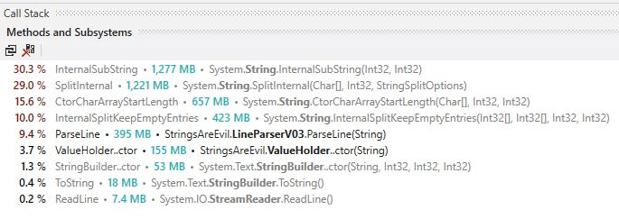
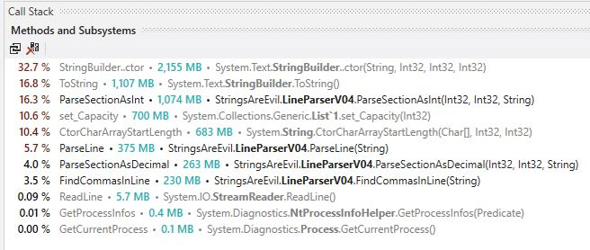
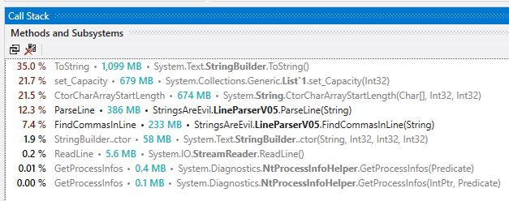
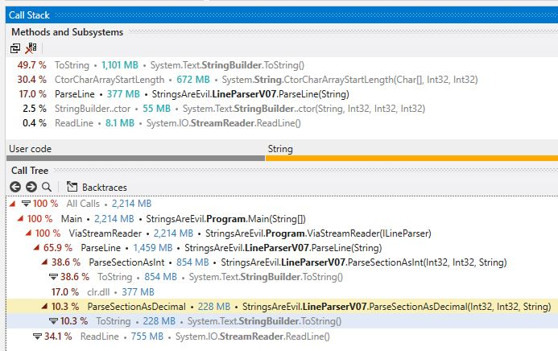
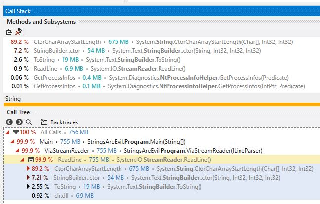

# Strings Are Evil

## Contents
1. [Context of the problem](#context-of-the-problem)
2. [Establishing a baseline](#establishing-a-baseline)
3. [Easy win 1](#easy-win-1)
4. [Easy win 2](#easy-win-2)
5. [Splits are never cool](#splits-are-never-cool)
6. [Lists are not always nice](#lists-are-not-always-nice)
7. [Pooling byte arrays](#pooling-byte-arrays)
8. [Goodbye StringBuilder](#goodbye-stringbuilder)
9. [Skipping commas](#skipping-commas)
10. [The war between classes and structs](#the-war-between-classes-and-structs)
11. [Goodbye StreamReader](#goodbye-streamreader)
12. [TLDR - give me a table](#tldr---give-me-a-table)

## Context of the problem
Codeweavers is financial services as a software company, part of what we do is to enable our customers to bulk import their data into our platform. This data is then used to power our real-time calculations. One of our customers has a daily process which includes them dropping a ZIP file onto our FTP. This ZIP file contains fourteen text files with file sizes ranging from a few kilobytes to several hundred megabytes. Currently this import process has to take place outside of business hours because of the impact it has on memory usage.

In this tech blog post we will explore potential optimisations to the import process specifically within the context of reducing memory during the import process. If you want to have a go yourself, I have put together an [example input file](http://link-to-file-on-s3.com) that mimics the real file. I have chosen to focus on the largest file in the ZIP file which is around three hundred megabytes.

## Establishing a baseline
The current implementation uses `StreamReader` and pass each line to the `lineParser`.
```
using (StreamReader reader = File.OpenText(@"..\..\example-input.csv"))
{
    try
    {
        while (reader.EndOfStream == false)
        {
            lineParser.ParseLine(reader.ReadLine());
        }
    }
    catch (Exception exception)
    {
        throw new Exception("File could not be parsed", exception);
    }
}
```
The most naive implementation of a line parser that we originally had looked something like this:-

```
public sealed class LineParserV01 : ILineParser
{
    public void ParseLine(string line)
    {
        var parts = line.Split(',');

        if (parts[0] == "MNO")
        {
            var valueHolder = new ValueHolder(line);
        }
    }
}
```

The `ValueHolder` class is used later on in the import process to insert information into the database:-

```
public class ValueHolder
{
    public int ElementId { get; }
    public int VehicleId { get; }
    public int Term { get; }
    public int Mileage { get; }
    public decimal Value { get; }

    public ValueHolder(string line)
    {
        var parts = line.Split(',');

        ElementId = int.Parse(parts[1]);
        VehicleId = int.Parse(parts[2]);
        Term = int.Parse(parts[3]);
        Mileage = int.Parse(parts[4]);
        Value = decimal.Parse(parts[5]);
    }
}
```

Running this example as a command line application and enabling monitoring:-

```
public static void Main(string[] args)
{
    AppDomain.MonitoringIsEnabled = true;

    // do the parsing
    
    Console.WriteLine($"Took: {AppDomain.CurrentDomain.MonitoringTotalProcessorTime.TotalMilliseconds:#,###} ms");
    Console.WriteLine($"Allocated: {AppDomain.CurrentDomain.MonitoringTotalAllocatedMemorySize / 1024:#,#} kb");
    Console.WriteLine($"Peak Working Set: {Process.GetCurrentProcess().PeakWorkingSet64 / 1024:#,#} kb");

    for (int index = 0; index <= GC.MaxGeneration; index++)
    {
        Console.WriteLine($"Gen {index} collections: {GC.CollectionCount(index)}");
    }
}
```
Even though our main goal today is to reduce [allocated](https://blog.maartenballiauw.be/post/2016/10/19/making-net-code-less-allocatey-garbage-collector.html) [memory](http://tooslowexception.com/allocation-is-cheap-until-it-is-not/) we will be keeping an eye on the time taken to process the file. In short, the less memory we allocate, the less work the garbage collector has to do. There are [three generations](https://docs.microsoft.com/en-us/dotnet/standard/garbage-collection/fundamentals#generations) that garbage collector operates against, we will also be monitoring those. Garbage collection is a complex topic and outside of the scope of this blog post; but a good rule of thumb is that short-lived objects should never be promoted past generation 0.

We can see `V01` has the following statistics:-

```
Took: 8,703 ms
Allocated: 7,412,229 kb
Peak Working Set: 16,708 kb
Gen 0 collections: 1809
Gen 1 collections: 0
Gen 2 collections: 0
```

Almost 7.5 GB of memory allocations to parse a three hundred megabyte file is less than ideal. Now that we  have established the baseline, let us find some easy wins...

## Easy win 1

Eagle-eyed readers will have spotted that we `string.Split(',')` twice; once in the line parser and again in the constructor of `ValueHolder`. This is wasteful, we can overload the constructor of `ValueHolder` to accept a `string[]` array and split the line once in the parser. After that simple change the statistics for `V02` are now:-
```
Took: 6,859 ms
Allocated: 4,288,221 kb
Peak Working Set: 16,784 kb
Gen 0 collections: 1046
Gen 1 collections: 0
Gen 2 collections: 0
```
Great! We are down from 7.5GB to 4.2GB. But that is still a lot of memory allocations for processing a three hundred megabyte file.

## Easy win 2

Quick analysis of the input file reveals that there are `10,047,435` lines, we are only interested in lines that are prefixed with `MNO` of which there are `10,036,466` lines. That means we are unnecessarily processing an additional `10,969` lines. A quick change to `V03` to only parse lines prefixed with `MNO`:-

```
public sealed class LineParserV03 : ILineParser
{
    public void ParseLine(string line)
    {
        if (line.StartsWith("MNO"))
        {
            var valueHolder = new ValueHolder(line);
        }
    }
}
```

This means we defer splitting the entire line until we know it is a line we are interested in. Unfortunately this did not save us much memory. Mainly because we are interested in `99.89%` of the lines in the file. The statistics for `V03`:-

```
Allocated: 4,284,808 kb
Peak Working Set: 16,736 kb
Gen 0 collections: 1046
Gen 1 collections: 0
Gen 2 collections: 0
```

It is time to break out the trusty profiler, in this case [dotTrace](https://www.jetbrains.com/profiler/).



Strings in the .NET ecosystem are immutable. Meaning that anything we do to a `string` _always_ returns a brand new copy. Therefore calling `string.Split(',')` on every line (remember there are `10,036,466` lines we are interested in) returns that line split into several smaller strings. Each line at minimum has five sections we want to process. That means in the lifetime of the import process we create at least `50,182,330` strings..! Next we will explore what we can do to eliminating  the use of `string.Split(',')`.

## Splits are never cool

A typical line we are interested in looks something like this:-

```
MNO,3,813496,36,30000,78.19,,
```

Calling `string.Split(',')` on the above line will return a `string[]` containing:-

```
'MNO'
'3'
'813496'
'36'
'30000'
'78.19'
''
''
```

Now at this point we can make some guarantees about the file we are importing:-

- The length of each line is not fixed
- The number of sections that are delimited by a comma are fixed
- We only use the first three characters of each line to determine our interest in the line
- This mean there are five sections we are interested in but the section length is unknown
- Sections do not change locations (e.g `MNO` is always the first section)

Guarantees established, we can now build a short lived index of the positions of all the commas for a given line:-

```
private List<int> FindCommasInLine(string line)
{
    var list = new List<int>();

    for (var index = 0; index < line.Length; index++)
    {
        if (line[index] == ',')
        {
            list.Add(index);
        }
    }

    return list;
}
```

Once we know the position of each comma, we can directly access the section we care about and manually parse that section.

```
private decimal ParseSectionAsDecimal(int start, int end, string line)
{
    var sb = new StringBuilder();

    for (var index = start; index < end; index++)
    {
        sb.Append(line[index]);
    }

    return decimal.Parse(sb.ToString());
}

private int ParseSectionAsInt(int start, int end, string line)
{
    var sb = new StringBuilder();

    for (var index = start; index < end; index++)
    {
        sb.Append(line[index]);
    }

    return int.Parse(sb.ToString());
}
```

Putting it all together:-

```
public void ParseLine(string line)
{
    if (line.StartsWith("MNO"))
    {
        var findCommasInLine = FindCommasInLine(line);

        var elementId = ParseSectionAsInt(findCommasInLine[0] + 1, findCommasInLine[1], line); // equal to parts[1] - element id
        var vehicleId = ParseSectionAsInt(findCommasInLine[1] + 1, findCommasInLine[2], line); // equal to parts[2] - vehicle id
        var term = ParseSectionAsInt(findCommasInLine[2] + 1, findCommasInLine[3], line); // equal to parts[3] - term
        var mileage = ParseSectionAsInt(findCommasInLine[3] + 1, findCommasInLine[4], line); // equal to parts[4] - mileage
        var value = ParseSectionAsDecimal(findCommasInLine[4] + 1, findCommasInLine[5], line); // equal to parts[5] - value
        var valueHolder = new ValueHolder(elementId, vehicleId, term, mileage, value);
    }
}
```

Running `V04` reveals this statistics:-
```
Took: 9,719 ms
Allocated: 6,727,601 kb
Peak Working Set: 16,848 kb
Gen 0 collections: 1642
Gen 1 collections: 0
Gen 2 collections: 0
```

Whoops, that is worse than expected. It is an easy mistake to make but dotTrace can help us here...



Constructing a `StringBuilder` for every section in every line is incredibly expensive. Luckily it is a quick fix, we constructor a single `StringBuilder` on the construction of `V05` and clear it before each usage. `V05` now has the following statistics:-

```
Took: 9,125 ms
Allocated: 3,199,130 kb
Peak Working Set: 16,720 kb
Gen 0 collections: 781
Gen 1 collections: 0
Gen 2 collections: 0
```

Phew we are back on the downwards trends. We started at 7.5GB and now we are down to 3.2GB. 

## Lists are not always nice
At this point dotTrace becomes an essential part of the optimisation process. Looking at `V05` dotTrace output:-



Building the short lived index of commas positions is expensive. As underneath any `List<T>` is just a standard `T[]` array. The framework takes care of re-sizing the underlying array when elements are added. This is useful and very handy in typical scenarios. However, we know that there are six sections we need to process (but we are only interested in five of those sections), ergo there are at least seven commas we want indexes for. We can optimise for that:-

```
private int[] FindCommasInLine(string line)
{
    var nums = new int[7];
    var counter = 0;

    for (var index = 0; index < line.Length; index++)
    {
        if (line[index] == ',')
        {
            nums[counter++] = index;
        }
    }

    return nums;
}
```

`V06` statistics:-

```
Took: 8,031 ms
Allocated: 2,650,260 kb
Peak Working Set: 16,572 kb
Gen 0 collections: 647
Gen 1 collections: 0
Gen 2 collections: 0
```

2.6GB is pretty good, but what happens if we force the compiler to use `byte` for this method instead of the compiler defaulting to use `int`:-

```
private byte[] FindCommasInLine(string line)
{
    byte[] nums = new byte[7];
    byte counter = 0;

    for (byte index = 0; index < line.Length; index++)
    {
        if (line[index] == ',')
        {
            nums[counter++] = index;
        }
    }

    return nums;
}
```

Re-running `V06`:-
```
Took: 8,188 ms
Allocated: 2,454,234 kb
Peak Working Set: 16,580 kb
Gen 0 collections: 599
Gen 1 collections: 0
Gen 2 collections: 0
```

2.6GB was pretty good, 2.4GB is even better. This is because an `int` has a much [larger range](https://docs.microsoft.com/en-us/dotnet/csharp/language-reference/keywords/integral-types-table) than a `byte`.

## Pooling byte arrays

`V06` now has a `byte[]` array that holds the index of each comma for each line. It is a short lived array, but it is created many times. We can eliminate the cost of creating a new `byte[]` for each line by using a recent addition to the .NET ecosystem; `Systems.Buffers`. Adam Sitnik has a [great breakdown](http://adamsitnik.com/Array-Pool/) on using it and why you should. The important thing to remember when using `ArrayPool<T>.Shared` is you must _always_ return the rented buffer after you are done using it otherwise you **will** introduce a memory leak into your application.

This is what `V07` looks like:-

```
public void ParseLine(string line)
{
    if (line.StartsWith("MNO"))
    {
        var tempBuffer = _arrayPool.Rent(7);

        try
        {
            var findCommasInLine = FindCommasInLine(line, tempBuffer);
            // truncated for brevity
        }
        finally
        {
            _arrayPool.Return(tempBuffer, true);
        }
    }
}

private byte[] FindCommasInLine(string line, byte[] nums)
{
    byte counter = 0;

    for (byte index = 0; index < line.Length; index++)
    {
        if (line[index] == ',')
        {
            nums[counter++] = index;
        }
    }

    return nums;
}
```

And `V07` has the following statistics:-

```
Took: 9,094 ms
Allocated: 2,258,216 kb
Peak Working Set: 16,812 kb
Gen 0 collections: 551
Gen 1 collections: 0
Gen 2 collections: 0
```

Down to 2.2GB, having started at 7.5GB. It is pretty good, but we are not done yet.

## Goodbye StringBuilder

Profiling `V07` reveals the next problem:-



Calling `StringBuilder.ToString()` inside of the `decimal` and `int` parsers is incredibly expensive. It is time to deprecate `StringBuilder` and write our own `int` and `decimal` parsers without relying on strings and calling `int.parse()` / `decimal.parse()` <sup>1</sup>. According to the profiler this should shave off around 1GB. After writing our own `int` and `decimal` parsers `V08` now clocks in at:-
```
Took: 6,000 ms
Allocated: 1,160,800 kb
Peak Working Set: 16,760 kb
Gen 0 collections: 283
Gen 1 collections: 0
Gen 2 collections: 0
```
1.1GB is a huge improvement from where we were last (2.2GB) and even better than the baseline (7.5GB).

<sup>1</sup> see the repository for the implementation in code; too much to post in this blog

## Skipping commas

Until `V08` our strategy has been to find the index of every comma on each line and then use that information to create a sub-string which is then parsed by calling `int.parse()` / `decimal.parse()`. `V08` deprecates the use of sub-strings but still uses the short lived index of comma positions.

An alternative strategy would be to skip to the section we are interested in by counting the number of preceding commas parse anything after the required number of commas and return when we hit the next comma.

We have previously guaranteed that:-

- Each section is preceded by a comma.
- And that the location of each section within a line does not change.

This would also means we can deprecate the rented `byte[]` array because we are no longer building a short lived index:-

```
public sealed class LineParserV09 : ILineParser
{
    public void ParseLine(string line)
    {
        if (line.StartsWith("MNO"))
        {
            int elementId = ParseSectionAsInt(line, 1); // equal to parts[1] - element id
            int vehicleId = ParseSectionAsInt(line, 2); // equal to parts[2] - vehicle id
            int term = ParseSectionAsInt(line, 3); // equal to parts[3] - term
            int mileage = ParseSectionAsInt(line, 4); // equal to parts[4] - mileage
            decimal value = ParseSectionAsDecimal(line, 5); // equal to parts[5] - value
            var valueHolder = new ValueHolder(elementId, vehicleId, term, mileage, value);
        }
    }
}
```

Unfortunately `V09` does not save us any memory, it does however reduce the time by around one second:-

```
Took: 5,688 ms
Allocated: 1,160,793 kb
Peak Working Set: 16,492 kb
Gen 0 collections: 283
Gen 1 collections: 0
Gen 2 collections: 0
```

Another benefit of `V09` is that is reads much more closer to the original implementation.

## The war between classes and structs

This blog post is not going to cover the difference or the pros/cons of classes vs structs. That topic has been [covered](https://softwareengineering.stackexchange.com/questions/92339/when-do-you-use-a-struct-instead-of-a-class) [many](https://stackoverflow.com/questions/13049/whats-the-difference-between-struct-and-class-in-net) [times](https://docs.microsoft.com/en-us/dotnet/standard/design-guidelines/choosing-between-class-and-struct). In this particular context, it is beneficial to use a `struct`. Changing `ValueHolder` to a `struct` in `V10` has the following statistics:-

```
Took: 5,688 ms
Allocated: 768,740 kb
Peak Working Set: 16,540 kb
Gen 0 collections: 187
Gen 1 collections: 0
Gen 2 collections: 0
```

Finally, we are below the 1GB barrier. Also, word of warning please do not use a `struct` blindly, always test your code and make sure the use case is correct.

## Goodbye StreamReader

As of `V10` the line parser itself is virtually allocation-less. dotTrace reveals where the remaining allocations occur:-



Well this is awkward, the framework is costing us memory allocations. We can interact with the file at a lower-level than a `StreamReader`:-

```
private static void ViaRawStream(ILineParser lineParser)
{
    var sb = new StringBuilder();

    using (var reader = File.OpenRead(@"..\..\example-input.csv"))
    {
        try
        {
            bool endOfFile = false;
            while (reader.CanRead)
            {
                sb.Clear();

                while (endOfFile == false)
                {
                    var readByte = reader.ReadByte();
                    
                    // -1 means end of file
                    if (readByte == -1)
                    {
                        endOfFile = true;
                        break;
                    }

                    var character = (char)readByte;
                    
                    // this means the line is about to end so we skip
                    if (character == '\r')
                    {
                        continue;
                    }

                    // this line has ended
                    if (character == '\n')
                    {
                        break;
                    }

                    sb.Append(character);
                }

                if (endOfFile)
                {
                    break;
                }

                var buffer = new char[sb.Length];

                for (int index = 0; index < sb.Length; index++)
                {
                    buffer[index] = sb[index];
                }

                lineParser.ParseLine(buffer);
            }
        }
        catch (Exception exception)
        {
            throw new Exception("File could not be parsed", exception);
        }
    }
}
```

`V11` statistics:-

```
Took: 5,594 ms
Allocated: 695,545 kb
Peak Working Set: 16,644 kb
Gen 0 collections: 169
Gen 1 collections: 0
Gen 2 collections: 0
```

Well, 695MB is still better than 768MB. Okay, that was not the improvement I was expecting (and rather anti-climatic). Until that is, we remember we have previously seen and solved this problem before. In `V07` we used `ArrayPool<T>.Shared` to prevent lots of small `byte[]`. We can do the same here:-

```
private static void ViaRawStream(ILineParser lineParser)
{
    var sb = new StringBuilder();
    var charPool = ArrayPool<char>.Shared;

    using (var reader = File.OpenRead(@"..\..\example-input.csv"))
    {
        try
        {
            bool endOfFile = false;
            while (reader.CanRead)
            {
                // truncated for brevity

                char[] rentedCharBuffer = charPool.Rent(sb.Length);

                try
                {
                    for (int index = 0; index < sb.Length; index++)
                    {
                        rentedCharBuffer[index] = sb[index];
                    }

                    lineParser.ParseLine(rentedCharBuffer);
                }
                finally
                {
                    charPool.Return(rentedCharBuffer, true);
                }
            }
        }
        catch (Exception exception)
        {
            throw new Exception("File could not be parsed", exception);
        }
    }
}
```

The final version of `V11` has the following statistics:-

```
Took: 6,766 ms
Allocated: 32 kb
Peak Working Set: 12,524 kb
Gen 0 collections: 0
Gen 1 collections: 0
Gen 2 collections: 0
```

Yes, only 32kb of memory allocations. There **is** the climax I was looking for.

## TLDR - Give me a table

Ask and ye shall receive:-

|Version|Took (ms)  |Allocated (kb) |Peak Working Set (kb) | Gen 0 Collections
|-      |-          |-              |-                     |-
|01     |8,797      |7,412,234      |16,524                |1809 
|02     |6,969      |4,288,215      |16,640                |1046
|03     |8,313      |4,284,799      |16,532                |1046
|04     |9,609      |6,727,601      |16,560                |1642
|05     |8,938      |3,199,131      |16,396                |781
|06     |8,219      |2,454,235      |16,328                |599
|07     |8,984      |2,258,216      |16,576                |551
|08     |6,094      |1,160,794      |16,796                |283
|09     |5,609      |1,160,792      |16,312                |283
|10     |5,609      |768,739        |16,344                |187
|11     |6,766      |32             |12,380                |0